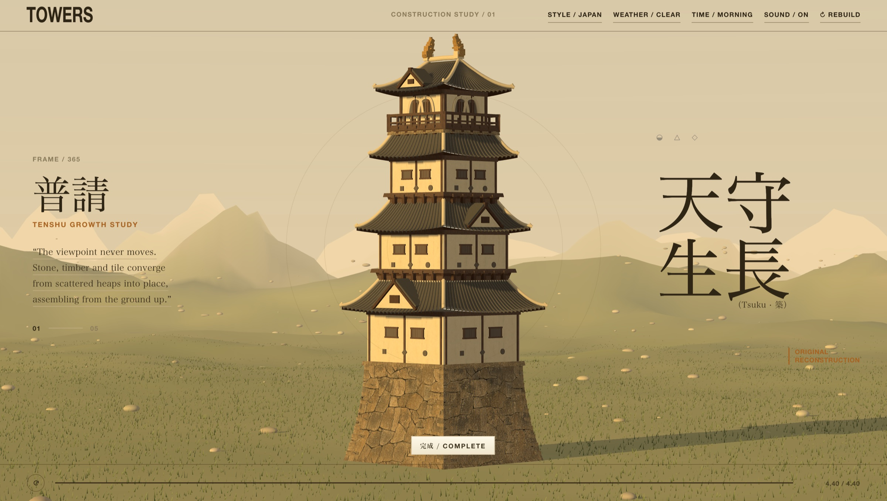
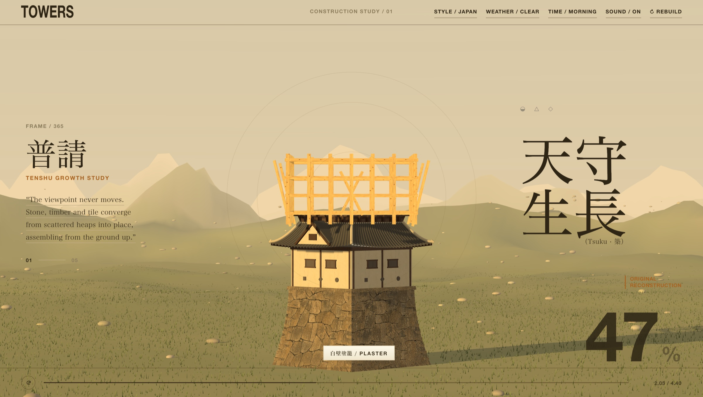
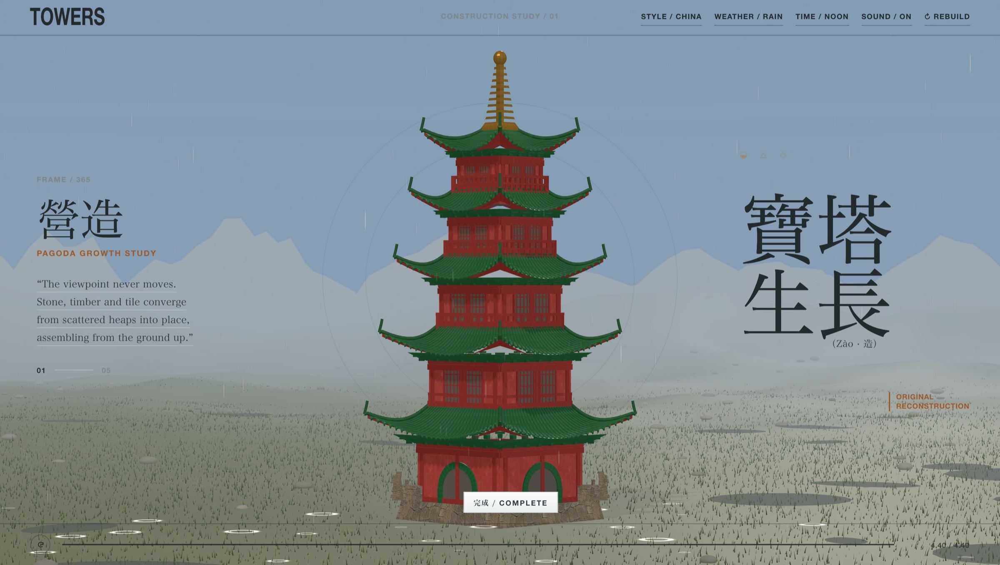

# Towers

A tower builds itself from the ground up in four and a half seconds. A cut plane rises through the model and everything below it is finished work — stone, timber, plaster, tile — while the scaffolding waits above the line. Switch the style and the same construction runs as a Japanese tenshu, a Chinese pagoda, or a Thai prang.

[**View the live site**](https://mengto.github.io/towers/)



## Inspiration

Built after seeing [@IndieDevHailey](https://x.com/IndieDevHailey)'s [ancient tower study](https://x.com/IndieDevHailey/status/2085560246861447182), where a Chinese tower assembles itself inside a print-like layout. That post set the frame: a fixed camera, a rising build, and typography that behaves like a page rather than a UI. Everything past that — the architecture, the landscape, the times of day, the weather, the sound — came from asking for one behaviour at a time and rebuilding whatever looked wrong.

## What is inside

- Three towers modelled at the same level of detail: a **Japanese tenshu** with stone ishigaki base, plastered storeys and flying eaves; a **Chinese pagoda** in vermilion lacquer and green glaze under a gilt finial; a **Thai prang** rising from a stepped plinth to a gold spire.
- A construction that runs in 4.40 seconds, captioned by stage in the local language and in English — 石垣普請 / STONEWORK, 白壁塗籠 / PLASTER, 瓦葺仕舞 / ROOFING — with a completion percentage set large in the corner.
- Drag to orbit the tower, or just move the pointer and the camera leans with it. The wheel zooms from 50% to 200%. Double-click or press `C` to recentre.
- Scrub the timeline at the foot of the page to sit anywhere in the build, or press `Space` to pause it mid-air.
- Four times of day that cross-fade rather than cut — morning, noon, sunset, night — each with its own sun, fog, ground and sky. Night brings out 39,200 stars.
- Three weather states: clear, rain that pools the ground and kicks up splashes, and snow that whitens it.
- A generated score and construction sounds per country: shakuhachi and koto for Japan, guqin and xiao for China, ranat ek and khim for Thailand, with mallet, chisel and tile sounds mixed under the build and a temple bell on completion.
- No build step, no dependencies to install, and no network requests. The page makes zero subresource requests once the document loads.



## How it is made

**The cut plane.** The whole tower exists from the first frame. A single `THREE.Plane` facing down travels up through the scene and every structural material clips against it, shadows included, so nothing above the line is drawn. A four-sided cap mesh sits at the plane's height and scales to the tower's footprint, which is what turns a hollow clipped section into what reads as a solid course of masonry. Scaffolding is the exception: it ignores the plane and stands above the line, so the frame is always one step ahead of the finished work.

**The architecture.** Every tower is generated from a small set of builders — swept plans, prisms, rings, arcs, tubes and lathes — rather than a mesh file. Roofs are the interesting part: each tile is placed by a function of its position along the eave, with separate controls for lift, tip, flare and truncation, which is what gives a hip roof its upward curl at the corners and lets a lower roof die cleanly behind the wall above it. The three styles are three parameter sets and three assembly functions over the same primitives, which is why they can share the timeline, the scaffolding and the stage system.

**The materials.** Ten surface textures — masonry, lime plaster, kawara tile, cedar, scaffolding pine, green glaze, vermilion lacquer, orange roof tile, gold leaf and bare ground — were generated with GPT Image 2, made seamlessly tileable by cross-fading each image against a half-offset copy of itself, graded, and embedded as WebP data URIs (565 KB in total). Bump and roughness maps are derived at load time from each colour map, so one image does the work of three. Box UVs are rewritten in world units before upload, otherwise a long scaffolding pole and a short one get the same grain and both read as plastic.

**The landscape.** The ground is a simplex heightfield sampled on a polar grid centred under the camera, coloured by slope, height and moisture rather than by texture. 104,000 grass blades are one instanced ribbon shaped entirely in the vertex shader, so the wind costs nothing on the CPU, and 2,400 stones are scattered by the same height function that draws the terrain. The sky is a six-stop gradient on a dome, with stars in three size classes confined to the elevation band the camera can actually reach — scattering them over the whole sphere with a 10° lens puts about six on screen. A finished frame is 1.31M triangles in 18 draw calls.

**The sound.** Three ambient loops, three construction beds and three bells were generated with Higgsfield — `sonilo_music` for the score, `mirelo_text_to_audio` for the effects — encoded to mono AAC and embedded as data URIs (609 KB). Music cross-fades on a gain bus when the style changes; the construction bed is sliced into one-shots with their own envelopes so the hammering tracks the build rather than looping under it.



## Run locally

Serve the folder with any static file server:

```bash
python3 -m http.server 4173 --bind 127.0.0.1
```

Then visit [http://127.0.0.1:4173/](http://127.0.0.1:4173/). Opening `index.html` straight off disk works too — there is nothing to fetch, so `file://` behaves the same as HTTP.

## Project structure

```text
towers/
├── index.html   # the entire page: layout, geometry, shaders, audio, textures
├── README.md
└── assets/      # README previews only, not used at runtime
```

`index.html` is 1.8 MB, and most of that is payload rather than code: a vendored Three.js r149 build (593 KB), the texture set (565 KB) and the audio (609 KB), all inline.

## Keyboard

`Space` play or pause · `R` rebuild · `S` style · `T` time of day · `W` weather · `C` recentre the camera

## Design and attribution

Towers is an independent study of East Asian tower architecture. The three towers are original constructions rather than models of specific buildings, and the project is not affiliated with any temple, castle or cultural institution. Textures were generated with GPT Image 2 and audio with Higgsfield, then art-directed into the scene. The vendored Three.js build retains its MIT licence notice.

## More open source

- **[The Complete Shelf](https://github.com/MengTo/complete-shelf)** — an original Three.js library of seven interactive clothbound hardcovers. [Live](https://mengto.github.io/complete-shelf/)
- **[Sketchbook](https://github.com/MengTo/sketchbook)** — a page-flipping sketchbook of Singapore in one static HTML file. [Live](https://mengto.com)
- **[Skills](https://github.com/MengTo/Skills)** — agent skills for designers and builders using Codex, Claude, Cursor and other AI coding agents. Browse them at [ui-skills.com](https://ui-skills.com).

## What I build

- **[Aura](https://aura.build)** — an AI website builder that creates landing pages in seconds and exports to HTML and Figma.
- **[Design+Code](https://designcode.io)** — learn to design and code React and Swift apps.
- **[DreamCut](https://dreamcut.ai)** — an AI video editor and screen recorder.

## Credits

- Concept: [@IndieDevHailey](https://x.com/IndieDevHailey)
- Textures: GPT Image 2 · Score and sound: Higgsfield
- Rendering: [Three.js](https://threejs.org/) r149, MIT
- Built with Claude Code

No licence is currently granted for reuse or redistribution of the Towers code or artwork. The bundled Three.js runtime remains under its own MIT licence.
