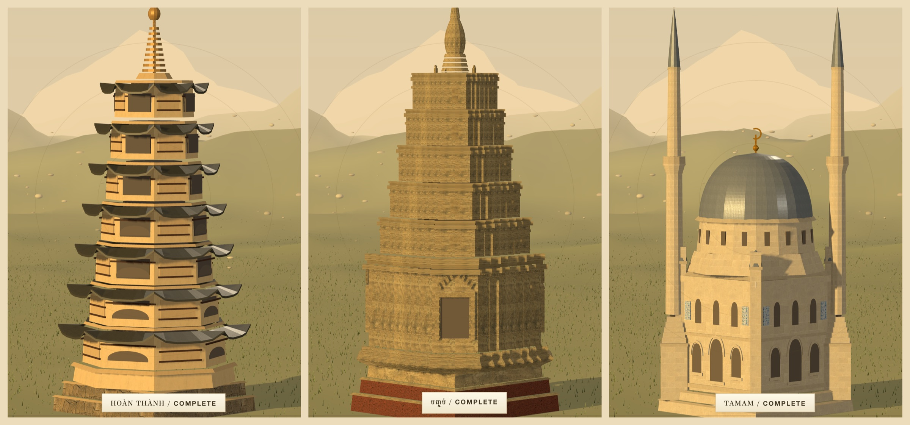
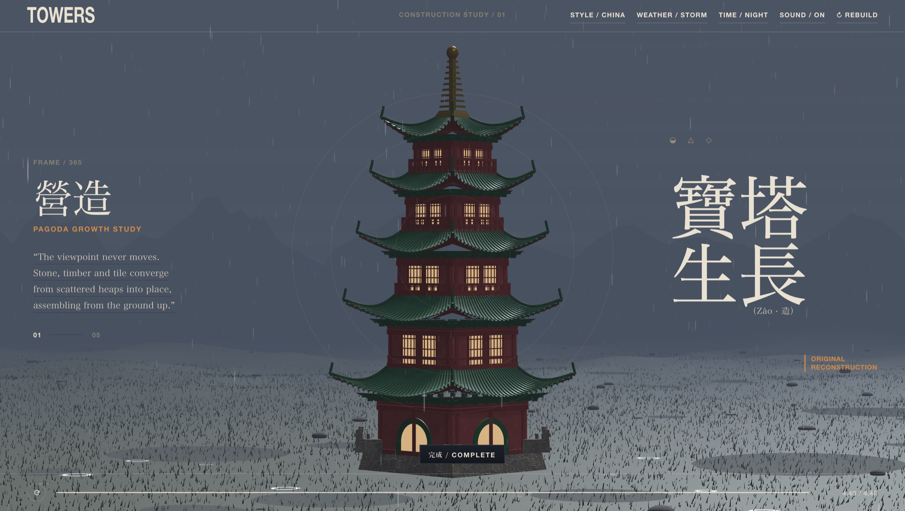
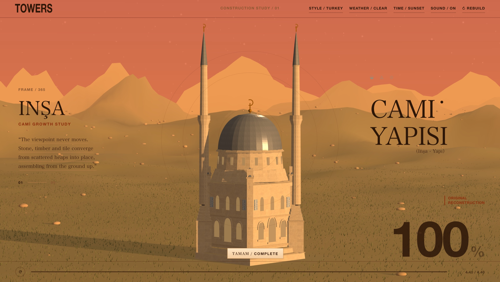
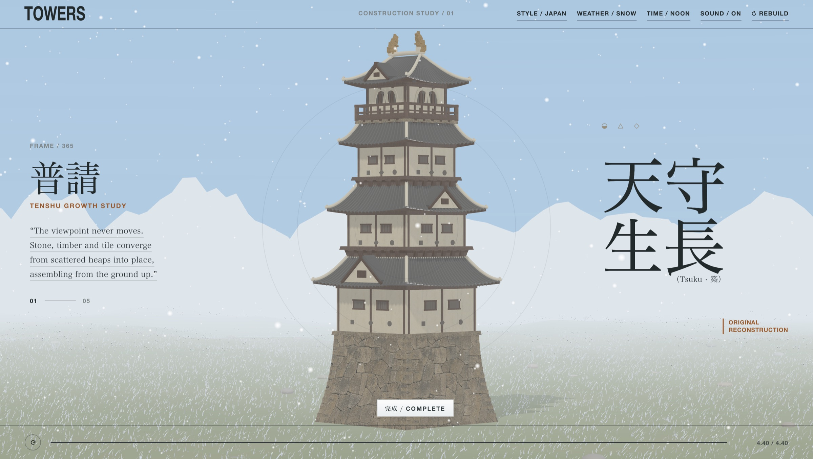

# Towers

A tower builds itself from the ground up in four and a half seconds. A cut plane rises through the model and everything below it is finished work — stone, timber, plaster, tile — while the scaffolding waits above the line. Switch the style and the same construction runs as a Japanese tenshu, a Chinese pagoda, a Vietnamese tháp, a Thai prang, a Khmer prasat, or an Ottoman mosque.

[**View the live site**](https://mengto.github.io/towers/)


## Inspiration

Built after seeing [@IndieDevHailey](https://x.com/IndieDevHailey)'s [ancient tower study](https://x.com/IndieDevHailey/status/2085560246861447182), where a Chinese tower assembles itself inside a print-like layout. That post set the frame: a fixed camera, a rising build, and typography that behaves like a page rather than a UI. Everything past that — the architecture, the landscape, the times of day, the weather, the sound — came from asking for one behaviour at a time and rebuilding whatever looked wrong.

## What is inside

- Six towers modelled at the same level of detail: a **Japanese tenshu** with stone ishigaki base, plastered storeys and flying eaves; a **Chinese pagoda** in vermilion lacquer and green glaze under a gilt finial; a **Vietnamese tháp** of seven octagonal storeys in Huế lime wash, each ringed by a tiled eave whose corners lift; a **Thai prang** rising from a stepped plinth to a gold spire; a **Khmer prasat** on laterite terraces, redented on plan, with false doors on three sides and five diminishing storeys; and an **Ottoman mosque** carrying a lead dome on an octagonal transition between two pencil minarets.
- A construction that runs in 4.40 seconds, captioned by stage in the local language and in English — 石垣普請 / STONEWORK, ថ្មភក់ / SANDSTONE, KUBBE / DOME, MÁI NGÓI / TILED EAVES — with a completion percentage set large in the corner.
- Drag to orbit the tower, or just move the pointer and the camera leans with it. The wheel zooms from 50% to 200%. Double-click or press `C` to recentre.
- Scrub the timeline at the foot of the page to sit anywhere in the build, or press `Space` to pause it mid-air.
- Four times of day that cross-fade rather than cut — morning, noon, sunset, night — each with its own sun, fog, ground and sky. Night brings out 39,200 stars.
- Four weather states: clear; rain that pools the ground and kicks up splashes; a storm that drives the rain over sideways, throws lightning across the sky and answers with thunder a beat later; and snow that blows up into blizzards and keeps settling until the field has gone white.
- A generated score and construction sounds per country: shakuhachi and koto for Japan, guqin and xiao for China, ranat ek and khim for Thailand, with mallet, chisel and tile sounds mixed under the build and a temple bell on completion.
- Weather you can hear: rain on tile, a storm bed with the wind up, thunder that arrives late and quiet when the strike was far off, and winter wind that rises into a blizzard and drops back again.
- A layout that rearranges rather than shrinks on a phone: the headline type moves into the sky, the controls come down into a strip within thumb reach, and two fingers pinch to zoom.
- No build step, no dependencies to install, and no network requests. The page makes zero subresource requests once the document loads.






## How it is made

**The cut plane.** The whole tower exists from the first frame. A single `THREE.Plane` facing down travels up through the scene and every structural material clips against it, shadows included, so nothing above the line is drawn. A four-sided cap mesh sits at the plane's height and scales to the tower's footprint, which is what turns a hollow clipped section into what reads as a solid course of masonry. Scaffolding is the exception: it ignores the plane and stands above the line, so the frame is always one step ahead of the finished work.

**The architecture.** Every tower is generated from a small set of builders — swept plans, prisms of any number of sides, rings, arcs, tubes and lathes — rather than a mesh file. Roofs are the interesting part: each tile is placed by a function of its position along the eave, with separate controls for lift, tip, flare and truncation, which is what gives a hip roof its upward curl at the corners and lets a lower roof die cleanly behind the wall above it. The buildings that are not square get their own primitive: the Khmer prasat is a redented outline — a square pushed out on each axis and stepped back twice before the corner — swept upward and rescaled for each storey, and the Vietnamese eaves are an octagonal ring whose outer edge drops away from the wall and lifts again at every corner. Six styles are six parameter sets and six assembly functions over the same primitives, which is why they can share the timeline, the scaffolding and the stage system.

The cut plane has to know what it is cutting: a square cap dropped into an octagonal tower leaves four wedges open to the sky, so each style declares the plan of its own section — four sides through a hall, eight through a drum, sixteen through a dome — and the cap geometry is rebuilt as the plane passes from one into the next.

**The materials.** Fifteen surface textures — masonry, lime plaster, kawara tile, cedar, scaffolding pine, green glaze, vermilion lacquer, orange roof tile, gold leaf, bare ground, Khmer sandstone, laterite, Ottoman limestone ashlar, lead sheet and İznik tile — were generated with GPT Image 2, made seamlessly tileable by cross-fading each image against a half-offset copy of itself, graded, and embedded as WebP data URIs (423 KB in total). Bump and roughness maps are derived at load time from each colour map, so one image does the work of three. Sizes and quality were chosen by measuring rather than by eye: each surface was swept across resolutions and WebP qualities, scored on both luma error and *gradient* error — the bump map is derived from luminance, so a texture can look fine and still wreck the relief — and the knee of that curve is what ships. Dropping eight points of quality turns out to cost a fraction of what dropping resolution does, and the İznik panels are 0.26 units wide on a fourteen-unit tower, so they never needed more than 256 pixels. Box UVs are rewritten in world units before upload, otherwise a long scaffolding pole and a short one get the same grain and both read as plastic.

**The landscape.** The ground is a simplex heightfield sampled on a polar grid centred under the camera, coloured by slope, height and moisture rather than by texture. 104,000 grass blades are one instanced ribbon shaped entirely in the vertex shader, so the wind costs nothing on the CPU, and 2,400 stones are scattered by the same height function that draws the terrain. The sky is a six-stop gradient on a dome, with stars in three size classes confined to the elevation band the camera can actually reach — scattering them over the whole sphere with a 10° lens puts about six on screen. A finished frame is 1.31M triangles in 18 draw calls.

**The weather.** A storm is not a separate scene, it is the rain state leaned on: the same drop pool with its draw range opened all the way, falling faster and slanting harder, under a sun that has almost gone and fog pulled in to a third of its reach. Lightning is a light of its own rather than a change to the sky, so a strike can flash over whatever the time of day happens to be — one leader and two or three return strokes on exponential decays, with the thunder scheduled by how far off the strike was, quieter the longer it takes to arrive. Snow runs on a slow clock of calm, build, blow and ease; the blizzard opens the flake pool, thickens the flakes, drives them sideways and pulls the fog in, while a separate counter tracks what has already landed and keeps whitening the ground, the stones and the blades for as long as it falls.

**The sound.** Twenty-four clips were generated with Higgsfield — `sonilo_music` for the six scores, `mirelo_text_to_audio` for the construction beds, bells, rain, storm, thunder and wind — encoded to mono AAC and embedded as data URIs (797 KB). Sample rate and bitrate were picked per clip by encoding, decoding back and comparing log-magnitude spectra against the source below 8 kHz. That measurement is what says the ambient scores are dull enough to sit at 24 kHz and 28 kbps and come out closer to the source than they were at 32 kHz and 40 kbps, that the bells and thunder are band-limited enough for 22 kHz, and that only the rain and wind beds genuinely need the top octave. Each country gets its own: shakuhachi and koto, guqin and xiao, đàn bầu and sáo trúc, ranat ek and khim, roneat and sralai, ney and kanun, with the mallets, chisels and tiles under the build chosen to match what the building is made of. Each weather bed is wrapped onto itself before encoding, tail cross-faded over head and the overlap discarded, so it loops with no seam to hear. Music and weather ride separate buses: the style cross-fades one, the blizzard swells a second bed over the first, and the construction bed is sliced into one-shots with their own envelopes so the hammering tracks the build rather than looping under it.





## Run locally

Serve the folder with any static file server:

```bash
python3 -m http.server 4173 --bind 127.0.0.1
```

Then visit [http://127.0.0.1:4173/](http://127.0.0.1:4173/). Opening `index.html` straight off disk works too — there is nothing to fetch, so `file://` behaves the same as HTTP.

## Project structure

```text
towers/
├── index.html   # the entire page: layout, geometry, shaders, audio, textures
├── README.md
└── assets/      # README previews only, not used at runtime
```

`index.html` is 2.3 MB, and most of that is payload rather than code: a vendored Three.js r149 build (593 KB), the texture set (423 KB) and the audio (797 KB), all inline. Nothing is fetched at runtime, so that figure is the whole download and there is never a second request — and since the base64 wrapping compresses away, what actually crosses the wire is about 1.4 MB.

## Keyboard

`Space` play or pause · `R` rebuild · `S` style · `T` time of day · `W` weather · `C` recentre the camera

On a phone: drag to orbit, pinch to zoom, double-tap to recentre.

## Design and attribution

Towers is an independent study of tower architecture across Asia. The six towers are original constructions rather than models of specific buildings, and the project is not affiliated with any temple, castle or cultural institution. Textures were generated with GPT Image 2 and audio with Higgsfield, then art-directed into the scene. The vendored Three.js build retains its MIT licence notice.

## More open source

- **[Kage](https://github.com/MengTo/kage)** — an interactive five-chapter night walk through a Kyoto mountain temple, rendered live in Three.js. [Live](https://mengto.github.io/kage/)
- **[The Complete Shelf](https://github.com/MengTo/complete-shelf)** — an original Three.js library of seven interactive clothbound hardcovers. [Live](https://mengto.github.io/complete-shelf/)
- **[Sketchbook](https://github.com/MengTo/sketchbook)** — a page-flipping sketchbook of Singapore in one static HTML file. [Live](https://mengto.com)
- **[Skills](https://github.com/MengTo/Skills)** — agent skills for designers and builders using Codex, Claude, Cursor and other AI coding agents. Browse them at [ui-skills.com](https://ui-skills.com).

## What I build

- **[Design+Code](https://designcode.io)** — learn to design and code React and Swift apps.
- **[Aura](https://aura.build)** — an AI website builder that creates landing pages in seconds and exports to HTML and Figma.
- **[DreamCut](https://dreamcut.ai)** — an AI video editor and screen recorder.

## Credits

- Concept: [@IndieDevHailey](https://x.com/IndieDevHailey)
- Textures: GPT Image 2 · Score and sound: Higgsfield
- Rendering: [Three.js](https://threejs.org/) r149, MIT
- Built with Claude Code

No licence is currently granted for reuse or redistribution of the Towers code or artwork. The bundled Three.js runtime remains under its own MIT licence.
